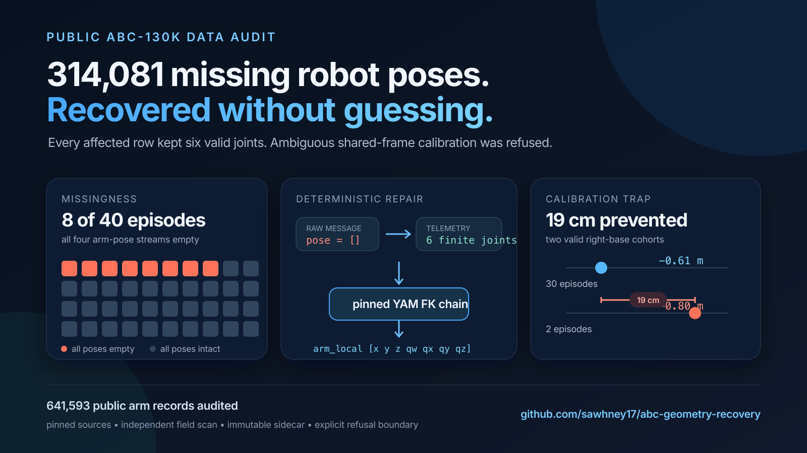

# ABC Geometry Recovery

[](https://github.com/sawhney17/abc-geometry-recovery/actions/workflows/test.yml)
[](https://sawhney17.github.io/abc-geometry-recovery/)
[](https://github.com/sawhney17/abc-geometry-recovery/releases/tag/v0.1.0)

I audited every raw MCAP in the ungated 40-episode ABC-130K preview and found **314,081 arm
records with `pose=[]`**. Every affected record retained valid joint telemetry, so this project
recovers the missing grasp geometry with versioned forward kinematics while preserving the source
logs and refusing any frame transform the evidence cannot establish.

The same audit found a second failure mode: two intact episodes use a right-arm base offset that is
19 cm different from the other 30 intact episodes. A cleaner that hard-codes the common transform
would silently corrupt 16,118 valid records.

**[Open the interactive recovery proof](https://sawhney17.github.io/abc-geometry-recovery/)**



## What the public audit found

Scope: all 40 `data/val/**/episode.fo.mcap` files in
[`Voxel51/ABC-130k`](https://huggingface.co/datasets/Voxel51/ABC-130k) at revision
`9659e8ce4b39580f48369cc31bc2e47a217c40e7`.

| Result | Count |
|---|---:|
| Source files | 40 |
| Source bytes | 3,509,376,768 |
| Exact arm state/action records | 641,593 |
| Empty pose fields | **314,081 (48.9533%)** |
| Intact 4x4 pose fields | 327,512 |
| Invalid joint vectors | 0 |
| Episodes with every arm pose missing | **8** |
| Episodes with every arm pose intact | 32 |
| Episodes with mixed pose presence | 0 |

An independent scanner that does not use the validator's pose/joint classification helpers
reopened and rehashed all 40 files. It reproduced the literal protobuf field histograms exactly:

```text
pose lengths:  {0: 314081, 16: 327512}
joint lengths: {6: 641593}
non-finite pose/joint records: 0
```

This is a complete result for the public 40-episode preview, not a prevalence claim for the gated
134,806-episode corpus. The larger count in
[`amazon-far/abc#13`](https://github.com/amazon-far/abc/issues/13) remains attributed to that issue
until the official raw corpus can be independently scanned.

## The repair slice

Release [`v0.1.0`](https://github.com/sawhney17/abc-geometry-recovery/releases/tag/v0.1.0)
contains a provenance-keyed Parquet sidecar for all eight affected public episodes:

| Published artifact | Result |
|---|---:|
| Rows | **314,081** |
| Source pose status | 314,081 missing |
| Joint status | 314,081 intact |
| FK status | 314,081 derived |
| Recovery status | 314,081 recovered |
| Output frame | arm-local only |
| Output bytes | 17,742,217 |
| SHA-256 | `511bc785df6df8a080e97530f991669f3527444a2bcfddb4816846f0bb97bcb6` |

- [Download the 314,081-row recovery sidecar](https://github.com/sawhney17/abc-geometry-recovery/releases/download/v0.1.0/abc-130k-public-missing-pose-recovery.parquet)
- [Inspect its source/model/output manifest](evidence/abc-130k-public-missing-pose-recovery.manifest.json)
- [Verify its checksum](evidence/abc-130k-public-missing-pose-recovery.sha256)
- [Inspect the compact public-40 result](evidence/public-40-summary.json)
- [Download the full audit](https://github.com/sawhney17/abc-geometry-recovery/releases/download/v0.1.0/abc-130k-public-40-geometry-audit.json)
- [Download the independent scan](https://github.com/sawhney17/abc-geometry-recovery/releases/download/v0.1.0/abc-130k-independent-protobuf-field-scan.json)

Each row includes the revision-pinned source URI and SHA-256, task, episode, topic, MCAP log and
publish timestamps, sequence, source-message ordinal, source/FK/recovery statuses, and a fixed 7D
`[x_m, y_m, z_m, qw, qx, qy, qz]` pose. All eight expected source hashes and byte sizes are checked
before decoding, then every source is rehashed after derivation. Two independent full generations
produced byte-identical Parquet.

The full audit's top-level verdict is intentionally `false`: it detected missing required fields
and a second calibration cohort. Its source-integrity, decoding, topic-accounting, and
classification invariants all pass.

## The 19 cm calibration trap

The 327,512 intact records validate the YAM joint order, units, chain, and `grasp_site` target.
They also show that the shared bimanual frame is not universal:

| Observed right-base translation | Intact episodes | Right-arm records |
|---|---:|---:|
| `[0, -0.61, 0]` m | 30 | 147,638 |
| `[0, -0.80, 0]` m | 2 | 16,118 |

With the correct episode cohort, maximum translation residual is `6.67e-16 m` and maximum rotation
residual is `4.52e-6 degrees`. Applying `-0.61 m` universally creates an exact `0.19 m` error on
the second cohort.

The eight affected episodes have no recorded poses from which to infer their rig cohort. The
release therefore emits only the independently determined **arm-local** pose. It explicitly does
not fabricate an absolute right-arm pose in the shared frame.

## Install and run

Python 3.10+ and [uv](https://docs.astral.sh/uv/) are required:

```bash
git clone https://github.com/sawhney17/abc-geometry-recovery.git
cd abc-geometry-recovery
uv sync --extra dev
```

Audit one or more raw episodes:

```bash
uv run abc-geometry audit-mcap episode-a.mcap episode-b.mcap \
  --report audit.json
```

Recover provenance-keyed arm-local geometry from raw MCAPs without editing them:

```bash
uv run abc-geometry recover-mcap episode-a.mcap episode-b.mcap \
  --output recovered.parquet \
  --dataset-id Voxel51/ABC-130k \
  --dataset-revision 9659e8ce4b39580f48369cc31bc2e47a217c40e7
```

For release-grade provenance, repeat `--source-uri`, `--source-sha256`, `--source-size-bytes`,
`--task`, and `--episode` exactly once per positional source. The command rejects a wrong expected
hash/size before decoding or staging output.

The pinned 40-file audit is generated by
[`scripts/audit_public_preview.py`](scripts/audit_public_preview.py), the exact public repair is
built with [`scripts/build_public_recovery.py`](scripts/build_public_recovery.py), and the
independent literal field cross-check is
[`scripts/independent_public_scan.py`](scripts/independent_public_scan.py).

## Secondary LeRobot augmentation

The release also demonstrates the same compiler pass on the first official
[`lerobot/abc_130k_v3_train`](https://huggingface.co/datasets/lerobot/abc_130k_v3_train)
Parquet shard. This is an augmentation, not a claim that the converted shard is corrupt.

| Result | Count |
|---|---:|
| Source episodes | 127 |
| Source rows | 384,567 |
| Arm-local pose columns | 4 |
| Derived pose vectors | 1,538,268 |
| Invalid inputs / FK failures | 0 / 0 |

- [Download the 81.4 MB LeRobot sidecar](https://github.com/sawhney17/abc-geometry-recovery/releases/download/v0.1.0/abc-geometry-file-000.parquet)
- [Inspect its manifest](evidence/abc-geometry-file-000.manifest.json)

It joins to the source on `episode_index`, `frame_index`, `index`, and `timestamp`, verifies the
14-D feature-name contract before derivation, and emits observed/commanded poses for both arms.

## The reusable product primitive

Robot labs lose expensive logs to missing derived fields, stale calibration, silent unit errors,
and ambiguous frame contracts. This project treats repair as a typed compiler pass rather than an
anomaly score:

```text
versioned robot model + typed telemetry + named frame
  -> independently validated derivation
  OR explicit quarantine
  -> keyed sidecar + provenance manifest
```

The next useful passes are cohort-aware calibration checks, timestamp/alignment certification,
and verified wrist-camera transforms. Each needs an intact control cohort and an explicit refusal
path. A concrete 10-episode lab pilot is specified in [`docs/pilot.md`](docs/pilot.md).

## Safety boundary

This release will not invent:

- a cross-arm/world/camera transform without validated calibration or cohort identity;
- joint order, units, quaternion convention, or timestamp semantics;
- task-success, failure, contact, force, or reward labels from weak proxies;
- a pose from invalid joints or a failed/non-finite FK result.

Source MCAPs and LeRobot shards are never modified. Outputs are staged, hashed, and published with
the manifest last as a verifiable commit marker. See [`docs/method.md`](docs/method.md) for the data
contract and [`docs/validation.md`](docs/validation.md) for the full evidence record.

## Upstream integration

[`amazon-far/abc#17`](https://github.com/amazon-far/abc/pull/17) proposes an opt-in export path in
the official ABC tooling. It derives the same arm-local end-effector representation directly from
the bundled YAM model while leaving legacy exports unchanged. The pull request is intentionally
separate from this pinned public-40 repair artifact: it prevents the omission in future exports;
the release sidecar repairs the already-published preview without rewriting its source files.

## Sources and licensing

- ABC project and model source: [amazon-far/abc](https://github.com/amazon-far/abc) (Apache-2.0)
- YAM model authors: [i2rt-robotics](https://github.com/i2rt-robotics) (MIT notice retained)
- Public raw preview: [Voxel51/ABC-130k](https://huggingface.co/datasets/Voxel51/ABC-130k)
  (Apache-2.0)
- Official joint-only conversion:
  [lerobot/abc_130k_v3_train](https://huggingface.co/datasets/lerobot/abc_130k_v3_train)

This community project is not affiliated with Amazon, FAR, XDOF, Hugging Face, Voxel51, or I2RT.
